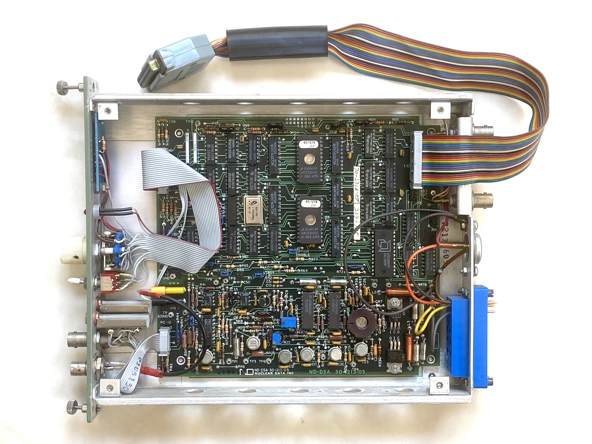

# Arduino based ADC interface
There are quite some professional NIM analog-digital-converters out there which
can be used for hobbyist gamma spectroscopy. The only problem being how to 
interface these devices as they often feature a proprietary interface.

A few weeks ago I got a Nuclear Data ND580 ADC which in fact came from a 
gamma spectroscopy setup. After some research it turned out that many of these 
ADCs seem to use a similar parallel interface. The various data and control
lines are available at a double row pin header within the ADC module and often 
also on a 25 pin SUB-D connector. (Some systems such as the Canberra 1510 only 
feature this 25 pin connector.)

# Interface description
This is how a typical classic ADC for gamma spectroscopy looks like. The flat
ribbon cable connects to the double row pin header on the upper right and 
features a 25 pin SUB-D connector which typically connects to some memory 
unit or computer interface.

Thanks to some friends I was able to deduce how this interface works. It is
quite simple, featuring 12 data lines and a couple of control and handshake
lines.

|Arduino port|Function|In/Out|SUB-D pin|Pinheader inside ADC|
|------------|--------|------|---------|-------------|
|PA0   |D0*       |IN    |1     |14|
|PA1   |D1*       |IN    |2     |16|
|PA2   |D2*       |IN    |3     |18|
|PA3   |D3*       |IN    |4     |20|
|PA4   |D4*       |IN    |5     |22|
|PA5   |D5*       |IN    |6     |24|
|PA6   |D6*       |IN    |7     |26|
|PA7   |D7*       |IN    |8     |15|
|PC0   |D8*       |IN    |9     |17|
|PC1   |D9*       |IN    |10    |19|
|PC2   |D10*      |IN    |11    |21|
|PC3   |D11*      |IN    |12    |23|
|PC4   |D12*      |IN    |13    |25|
|PC5   |Inhibit*  |IN    |20    |12|
|TXD1  |READY*    |IN    |14    |10|
|PB0   |ACCEPT*   |OUT   |17    |2|
|GND   |ENABLE*   |      |18    |8|
|GND   |OUT ENA*  |      |22    |4|
|GND   |GND       |      |24    |1, 3, 5, 7, 9, 11|

