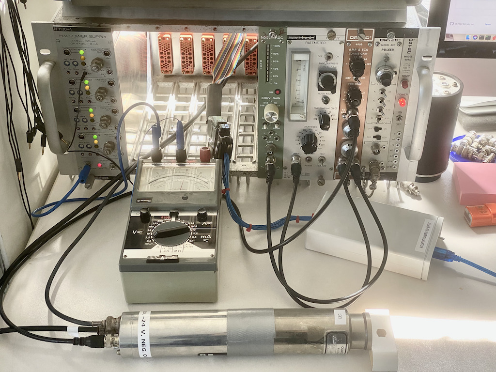

# Arduino based ADC interface
There are quite some professional NIM analog-digital-converters out there which
can be used for hobbyist gamma spectroscopy. The only problem being how to 
interface these devices as they often feature a proprietary interface.

A few weeks ago I got a Nuclear Data ND580 ADC which in fact came from a 
gamma spectroscopy setup. After some research it turned out that many of these 
ADCs seem to use a similar parallel interface. The various data and control
lines are available at a double row pin header within the ADC module and often 
also on a 25 pin SUB-D connector. (Some systems such as the Canberra 1510 only 
feature this 25 pin connector.)

# Interface description
This is how a typical classic ADC for gamma spectroscopy looks like. The flat
ribbon cable connects to the double row pin header on the upper right and 
features a 25 pin SUB-D connector which typically connects to some memory 
unit or computer interface.


Thanks to some friends I was able to deduce how this interface works. It is
quite simple, featuring up to 13 data lines (my ND580 ADC only has 4k of 
resolution and thus only drives twelve data lines) and a couple of control and 
handshake lines.

|Arduino port|Function|In/Out|SUB-D pin|Pinheader inside ADC|
|------------|--------|------|---------|-------------|
|PA0   |D0*       |IN    |1     |14|
|PA1   |D1*       |IN    |2     |16|
|PA2   |D2*       |IN    |3     |18|
|PA3   |D3*       |IN    |4     |20|
|PA4   |D4*       |IN    |5     |22|
|PA5   |D5*       |IN    |6     |24|
|PA6   |D6*       |IN    |7     |26|
|PA7   |D7*       |IN    |8     |15|
|PC0   |D8*       |IN    |9     |17|
|PC1   |D9*       |IN    |10    |19|
|PC2   |D10*      |IN    |11    |21|
|PC3   |D11*      |IN    |12    |23|
|PC4   |D12*      |IN    |13    |25|
|PC5   |Inhibit*  |IN    |20    |12|
|TXD1  |READY*    |IN    |14    |10|
|PB0   |ACCEPT*   |OUT   |17    |2|
|GND   |ENABLE*   |      |18    |8|
|GND   |OUT ENA*  |      |22    |4|
|GND   |GND       |      |24    |1, 3, 5, 7, 9, 11|

All of the interface signals are active low logic, denoted by the star behind 
the signal names. 

* D0 to D12 are the data lines from the ADC. 
* Inhibit can be set by the ADC to denote that a value should be discarded 
  (this signal is ignored in the interface described here).
* READY tells the interface that a new data words is available.
* ACCEPT tells the ADC that the data word has been read.
* ENABLE enables the ADC.
* OUT ENA enables the data lines which are otherwise in high-Z-mode (tri state).

The leftmost column in the table above lists the I/O-pins on the Arduino 
MEGA-2650 which I used in this project. Since the MEGA-2650 only has 8k bytes
of RAM of which a tiny amount is used for program variables, only 2048 channels
of a gamma spectrogram can be stored (at least at 16 bit counter resolution per
channel), so this interface only uses eleven of the twelve data lines, and the 
ADC should be set to 2k conversion gain.

# Arduino code
The C++ code [adc_readout/adc_readout.ino](adc_readout/adc_readout.ino) for the 
Arduino is quite simple and straightforward.
```
/*
    05-APR-2022 B. Ulmann Initial implementation
    08-APR-2022 B. Ulmann Added maximum output in 'c'-command
*/

#define BAUD_RATE 115200
#define READY_PIN 18
#define INT_MODE  FALLING
#define ADC_BITS  11        // 2k resolution

union {
  byte raw[2];
  uint16_t value;
} data;

uint16_t counters[1 << ADC_BITS];
uint32_t events = 0, maximum = 0;

void get_data() {
  byte low_byte, high_byte;
  
  detachInterrupt(digitalPinToInterrupt(READY_PIN));

  data.raw[0] = PINA;
  data.raw[1] = PINC & B00111111;

  uint16_t address = ~data.value & 0x0FFF;

  if (counters[address] != 65535)
    if (++counters[address] > maximum)
      maximum = counters[address];

  events++;

  if (!(events % 10000))  // Print a dot every 10000 values to show its alive
    Serial.print(".");
  
  PORTB = B00000000;  // Flip ACCEPT*
  PORTB = B00000001;

  attachInterrupt(digitalPinToInterrupt(READY_PIN), get_data, INT_MODE);
}

void setup() {
  DDRA = B00000000;   // Lower eight bits
  DDRB = B00000001;   // PB0 is an output
  DDRC = B00000000;   // Upper five bits + inhibit

  PORTB = B00000001;  // Deactivate ACCEPT*

  Serial.begin(BAUD_RATE);

  attachInterrupt(digitalPinToInterrupt(READY_PIN), get_data, INT_MODE);

  Serial.print("INIT...\n");
}

void loop() {
  if (Serial.available() > 0) {
    switch(Serial.read()) {
      case 'c': // Read counter
        detachInterrupt(digitalPinToInterrupt(READY_PIN));
        Serial.print("Events = " + String(events) + ", maximum value = " + String(maximum) + "\n");
        attachInterrupt(digitalPinToInterrupt(READY_PIN), get_data, INT_MODE);
        break;
      case 'r': // Readout
        detachInterrupt(digitalPinToInterrupt(READY_PIN));
        Serial.print("--------\n");
        for (uint16_t i = 0; i < (1 << ADC_BITS); Serial.print(String(counters[i++]) + "\n"));
        Serial.print("--------\n");
        attachInterrupt(digitalPinToInterrupt(READY_PIN), get_data, INT_MODE);
        break;
      case 'x': // Reset
        detachInterrupt(digitalPinToInterrupt(READY_PIN));
        events = maximum = 0;
        for (uint16_t i = 0; i < (1 << ADC_BITS); counters[i++] = 0);
        Serial.print("Reset\n");
        attachInterrupt(digitalPinToInterrupt(READY_PIN), get_data, INT_MODE);
        break;        
    }
  }
}
```

At the heart of the software is the interrupt routine get_data() which is 
called whenever the READY line has a falling edge. It reads an eleven bit 
data word into a union which effectively combines the two parts of this word
into a single 16 bit value, the channel number. It then increments the 
respective channel counter. It also counts the overall number of events 
detected to far and the maximum count number of all channels.

This little program communicates with an attached computer by means of the 
builtin USB interface employing a serial-line emulation. Three commands are
supported: 

* c: Return the number of overall events counted so far as well as the maximum
     peak in all channels.
* r: Read data from the 2048 channels. Data is returned as 2048 lines each 
     containing the number of events in a channel in decimal representation.
* x: Reset the device, i.e. clear all channel counters etc.

By default Arduinos perform a reset when a new serial line connection is 
established, which is quite undesirable in an application like this with 
long measurement times. It is advisable to cut the "reset" bridge on the 
Arduino board (see documentation for the MEGA-2650). Since this reset feature
is important for the programmability of the Arduino, a switch should be 
connected to this cut bridge connection (this is the switch labelled "run/prg").

The following pictures show the exterior of the interface and its construction:


# Readout and display software
Although it is possible and feasible to use this interface manually using the
serial monitor which is part of the Arduino IDE, copying the channel counts 
into a file and then using gnuplot or a similar tool to display the data, it
is more convenient to use a little tool written in Perl to communicate with 
the ADC interface.

```
#
#  This simple Perl program either reads raw data from the Arduino based ADC
# adapter which works with Nuclear Data ADCs such as the ND580 or with 
# similar Canberra devices like the Canberra 1510.
#
#  This program can perform several actions:
#
#   -r                              Reset the ACD adapter
#   -s                              Get statistics (events/maximum count)
#   -u <usb port> | -f <file name>  Read data from the device (USB) or a file
#       [-w <window size>]          Perform simple smoothing with a sliding window
#       [-d <file name>]            Save data to a file
#       [-t <title>]                Optional title for the plot
#
#  Data is displayed using gnuplot. The plot is not normalized with respect to
# its x- and y-axes, so there some other means of energy calibration must be 
# applied!
#
#  The program finished on the gnuplot prompt so the graph can be interactively
# rescaled, exported to various file formats etc. using the standard gnuplot
# capabilities.
#
# 2022-04-09    B. Ulmann   Initial version based on the old Perl program 
#                           targeted at the homebrew simple Gamma spectrometer.
# 2022-04-13    B. Ulmann   Added keV-scaling.
#

use strict;
use warnings;
use File::Temp;
use Getopt::Long qw(GetOptions);
use Device::SerialPort;
use Time::HiRes qw(usleep);

my $baudrate = 115200;
my $last_channel = 810;     # Energy of the last channel (experimentally determined).
                            # This is for the small PMT at 1.5 kV, with the 490B
                            # amplifier set to a gain of 5 * 4.

die "Usage: perl $0 [-w <window_size>] 
                       {-u <usb_port> | -f <filename>} 
                       [-d <destination_filename>]
                       [-t <title>]
       perl $0 -r (to reset the device)
       perl $0 -s (to get statistics)\n" 
    unless @ARGV;

my ($usb_port, $window_size, $filename, $destination, $statistics, $reset, $title);
$title = '';
GetOptions('u=s' => \$usb_port, 
           'w=s' => \$window_size, 
           'f=s' => \$filename, 
           'd=s' => \$destination, 
           's' =>   \$statistics, 
           'r' =>   \$reset,
           't=s' => \$title);

die "Either -f or -u must be specified!\n" if !defined($filename) and !defined($usb_port);
die "-f and -u are mutually exclusive!\n"  if  defined($filename) and  defined($usb_port);

my $port;
if (defined($usb_port)) {
    $port = Device::SerialPort->new($usb_port) or die "Unable to open USB-port: $!\n";
    $port->baudrate($baudrate);
    $port->databits(8);
    $port->parity('none');
    $port->stopbits(1);
}

if ($reset) {
    die "Reset requires a USB port to be specified!\n" unless defined($port);
    $port->write('x');  # Send reset command
    sleep(1);
    my $response = $port->lookfor();
    die "Illegal response from device: >>$response<<\n" unless $response =~ ".*Reset";
    print "Device has been reset.\n";
} elsif ($statistics) {
    die "Statistics requires a USB port to be specified!\n" unless defined($port);
    $port->write('c');  # Send reset command
    sleep(1);
    my $response = $port->lookfor();
    print "$response\n";
} else {
    my @data;
    if (defined($filename)) {
        open (my $handle, '<', $filename) or die "Could not open $filename: $!\n";
        while (my $record = <$handle>) {
            push(@data, $record) if $record =~ /^\d+$/;
        }
        close($handle);
    } else {
        print "Read data...\n";
        $port->write('r');  # Issue 'read' command to gamma spectrometer
        sleep(1);

        my $state = 0;
        for my $i (0 .. 3000) {
            usleep(100);
            my $response = $port->lookfor();
            last       if $response =~ /-+/ and $state == 1; # End of data area found
            $state = 1 if $response =~ /-+/ and $state == 0; # Start of data area found

            push(@data, $response) if $response =~ /^\d+/;
        }
    }
    print scalar(@data), " records read.\n";

    if (defined($destination)) {
        print "Saving raw data to $destination.\n";
        open(my $handle, '>', $destination) or die "Could not open $destination: $!\n";
        print $handle "$_\n" for @data;
        close($handle);
    }

    my (@smoothed, $counts);
    if (defined($window_size)) {
        print "Smoothing with window size $window_size.\n";
        my @window;
        push(@window, shift(@data)) for (1 .. $window_size);
        $counts += $_ for @window;
        for my $i (0 .. @data - 1) {
            my $average;
            $average += $_ for @window;
            push(@smoothed, $average / $window_size);
            shift(@window);
            $counts += $data[$i];
            push(@window, $data[$i]);
        }
    } else {
        @smoothed = @data;
        $counts += $_ for @data;
        print "No smoothing applied.\n";
    }
    print "$counts events detected.\n";

    my $handle = File::Temp->new();
    my $tempfile = $handle->filename();
    my $x = 0;
    my $increment = $last_channel / 2048;
    print $handle $x += $increment, " $_\n" for @smoothed;
    close($handle);

    system(qq(gnuplot -e "set xrange [0:$last_channel]; set title '$title'; set xlabel 'Energy [keV]'; set ylabel 'counts'; plot '$tempfile' w l" -));
}
```

# Setup and usage


