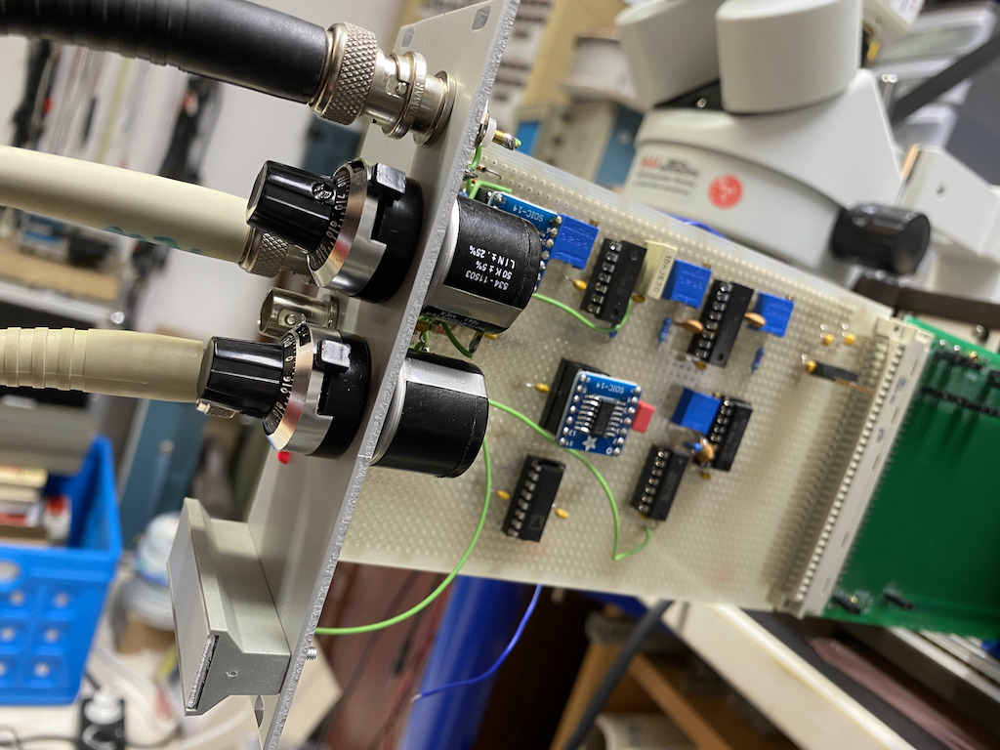

A simple analog front end for a gamma spectrometer
==================================================

Described here is my rather simple analog front end for a gamma spectrometer.
The circuit was developed over Christmas time 2020/2021, so I had to use what
was at hand, so there are certainly better ways to do it but it works pretty
good.

Functionality
-------------
What tasks are to be performed by the analog front end? First of all it 
receives the raw impulses from the photomultiplier tube which can be of 
either polarity. Since the following electronics requires positive impulses,
the input stage consists of two fast operational amplifiers (OPA4197), one
working in inverting mode and one working as non-inverting amplifier. The
polarity is selected manually by the switch labelled "POLARITY".

This signal is then fed to two sub-circuits: The first being a simple 
comparator (LM339) with adjustable threshold, the second one is a peak hold
stage. I experimented quite a lot with peak hold circuits but could not come
up with a suitable setup and thus decided to use a PKD01 integrated circuit
which is, unfortunately, long since obsolete. The PKD01 even has a built-in
comparator which would have rendered the LM339 unnecessary but at this stage
the overall circuit had already been implemented, so the LM339 stayed in 
place. :-} 

The output of the peak hold circuit is buffered by an operational amplifier
and fed to a BND connector labelled "PEAKOUT". 

The output of the comparator triggers a chain of three TTL monoflops. The 
first one (U5.1) generated a PRETRIG signal which in turn triggers U5.2 which
yields the actual TRIG signal. This signal controls a LED on the front panel,
is available on a BNC connector on the front panel and is also fed to the 
backplane where it can be used to trigger an interrupt routine in the 
microcontroller collecting the data.

The PKD01 has two control inputs: RESET (pin 1) and /DET (pin 14) which are
connected to the output of the third monoflop which is triggered by the TRIG
signal generated by the second monoflop. This signal is used to reset the 
PKD01 and prime it for the next pulse.

Setup
-----
There are basically four trim potentiometers which have to be set prior to
operation:

* TM1 is used to calibrate the output buffer amplifier so that the values
  shown on the dial of the precision potentiometer R4 correspond to the actual
  gain of the peak hold/amplifier stage.
* The three monoflops must be set to time constants suitable for the remaining
  circuitry. In my setup, the pre-trigger time is set to a few microseconds
  with TM2. The actual trigger signal duration is set to about 50 to 100 
  microseconds with TM3, while the reset signal duration is set with TM4 to
  a few microseconds again.

Limitations
-----------
This circuit has several limitations which should be addressed in the future.
First of all, the PKD01 is still looking actively for peaks, even if the 
comparator has triggered the monoflop chain. If two impulses follow each other
in rapid succession, with the second pulse being higher than the first one, 
the peak hold stage will charge its capacitor to the new peak even a trigger
signal has already been generated. 
