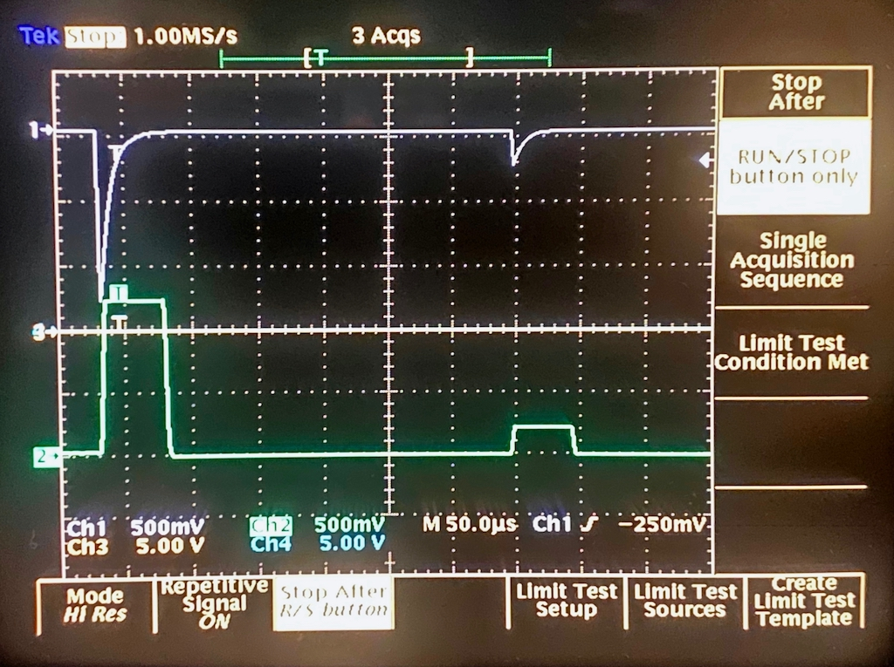

# Tiny Gamma Spectrometer
This directory contains my notes and sources for building a simple gamma
spectrometer. This was mainly developed over Christmas time 2020/2021, and I 
had to use what was at hand, so there are certainly better ways to do things,
something which I am fully aware of. :-)

## Overview
Some time ago I got a photomultiplier assembly together with a plastic 
scintillator Ne102 (which is not all too well suited for gamma spectroscopy
but it is a start) from an old environmental monitoring station in Germany. 
Since great devices like these have to be used, I decided to try and build
a simple gamma spectrometer, the first attempt of which can be seen here:


This project does not (!) include a high voltage power supply as I had a 
Knott high voltage supply in my lab which simplified things considerably.

The small chassis shown above contains (from left to right) a dual power
supply yielding +/-12 V, my analog front end card, a narrow card containing
an Arduino MEGA 2650 and a little TFT display showing the spectrum in real
time during measurement.

## A simple analog front end for a gamma spectrometer
This section describes the analog front end card shown above. On its front
panel are several BNC jacks, two precision potentiometers with precision
dials, a polarity selector switch, and two LEDs. The green LED is just a 
power-on LED, while the read LED lights whenever a pulse from the 
photomultiplier assembly has been detected. The BNC input on the upper 
right is connected to the photomultiplier. The upper precision potentiometer
controls the gain of the peak hold stage while the lower sets the 
threshold for the comparator detecting pulses. The toggle switch selects
the polarity of the input signal. The three BNC connectors below it yield
the following signals: Raw signal (inverter or non-inverted, depending on
the setting of the toggle switch), the amplified output of the peak hold
stage and a TTL trigger signal.

The circuit board looks like this:


...and here is the schematic:


### Functionality
What tasks are to be performed by the analog front end? First of all it 
receives the raw impulses from the photomultiplier tube which can be of 
either polarity. Since the following electronics requires positive impulses,
the input stage consists of two fast operational amplifiers (OPA4197), one
working in inverting mode and one working as non-inverting amplifier. The
polarity is selected manually by the switch labelled "POLARITY".

This signal is then fed to two sub-circuits: The first being a simple 
comparator (LM339) with adjustable threshold, the second one is a peak hold
stage. I experimented quite a lot with peak hold circuits but could not come
up with a suitable setup and thus decided to use a PKD01 integrated circuit
which is, unfortunately, long since obsolete. The PKD01 even has a built-in
comparator which would have rendered the LM339 unnecessary but at this stage
the overall circuit had already been implemented, so the LM339 stayed in 
place. :-} 

The output of the peak hold circuit is buffered by an operational amplifier
and fed to a BND connector labelled "PEAKOUT". 

The output of the comparator triggers a chain of three TTL monoflops. The 
first one (U5.1) generated a PRETRIG signal which in turn triggers U5.2 which
yields the actual TRIG signal. This signal controls a LED on the front panel,
is available on a BNC connector on the front panel and is also fed to the 
backplane where it can be used to trigger an interrupt routine in the 
microcontroller collecting the data.

The PKD01 has two control inputs: RESET (pin 1) and /DET (pin 14) which are
connected to the output of the third monoflop which is triggered by the TRIG
signal generated by the second monoflop. This signal is used to reset the 
PKD01 and prime it for the next pulse.

### Setup
There are basically four trim potentiometers which have to be set prior to
operation:

* TM1 is used to calibrate the output buffer amplifier so that the values
  shown on the dial of the precision potentiometer R4 correspond to the actual
  gain of the peak hold/amplifier stage.
* The three monoflops must be set to time constants suitable for the remaining
  circuitry. In my setup, the pre-trigger time is set to a few microseconds
  with TM2. The actual trigger signal duration is set to about 50 to 100 
  microseconds with TM3, while the reset signal duration is set with TM4 to
  a few microseconds again.

### Limitations
This circuit has several limitations which should be addressed in the future.
First of all, the PKD01 is still looking actively for peaks, even if the 
comparator has triggered the monoflop chain. If two impulses follow each other
in rapid succession, with the second pulse being higher than the first one, 
the peak hold stage will charge its capacitor to the new peak even a trigger
signal has already been generated. 

### Example of operation
The following picture shows the raw signal from the photomultiplier tube 
fed to the analog front end and the output of the peak hold stage:


## Digital back end
The peak output of the analog front and the trigger signal are fed to 
another standard perf board which contains an Arduino MEGA 2650 which was
chosen due to two reasons: First, I had one at hand :-) and second, it has
enough RAM to hold the raw spectrum data as well as compressed data to 
control the tiny TFT display. This board with the attached TFT display 
looks like this:


The display front panel not only holds the TFT display (which I just glued 
in as I did not have suitable screws at hand ;-) ) but also a three position
rotary switch and a BCD encoded switch. The rotary switch controls the mode
of operation: RUN, HALT, RESET. In RUN state data is gathered and the display
is constantly updated accordingly. HALT halts the data gathering process while
RESET resets all data collected so far.

Both switches have their "wiper" grounded and the outputs are pulled up by 
10k resistors. (I know that the Arduino has software selectable pull-up 
resistors on chip but it is hard to get rid of old habits...) The display
is a cheap 1.8 inch TFT display. The display is connected to the Arduino MEGA 
2650 as follows:
|Display pin|MEGA 2650|Comment|
|-----------|---------|-------|
|GND        |GND      |Ground |
|BL         |+5 V     |This controls the backlight|
|RESET      |D5       |Reset the display|
|D/C-LD     |D4       |Data/Command control line|
|CS-SD      |N/A      |Chip select for the SD card slot, not required|
|CS-LD      |D3       |Chip select for the display itself|
|MOSI       |MOSI     |Pin 51|
|SCK        |SCK      |Pin 52|
|MISO       |MISO     |Pin 50|
+5 V        |+5 V     ||

The switches are connected to the MEGA 2650 like this:
|Switch (with pull up, will be grounded when selected)|MEGA 2650 port|
|RUN|PH0|
|HALT|PH1|
|RESET|PH3|
|BCD 1|PD0|
|BCD 2|PD1|
|BCD 4|PD2|
|BCD 8|PD3|

## Control software
The control software is extremely straight-forward as there is no need for 
a more or less complicated peak detection since this is taken care of by the
analog front end already:
```
/*
 *  Simple gamma spectrometer based on an Arduino MEGA 2650. DEC-2020/JAN-2021, Bernd Ulmann.
 *  
 *   This program is the digital part of my rather simple homebrew gamma spectrometer which 
 *  consists of a (commercial) HV power supply, a photomultiplier tube with scintillator
 *  crystal, an analog front end (also described in the project directory), and an Arduino
 *  MEGA 2650 with a 1.8 inch TFT display, a 10 position BCD switch, and a rotary three
 *  position mode control switch.
 *  
 *   The analog front end consists of an input stage which can operate in inverting or
 *  non-inverting mode (so it is possible to used PMTs with the anode at HV or with cathode
 *  at -HV). This is followed by a peak-hold stage which feeds a comparator with adjustable
 *  threshold and an output amplifier with adjustable gain. The comparator generates a 
 *  trigger signal which is fed to the Arduino and causes one analog-digital-conversion of
 *  10 bits.
 *  
 *   This little program controls the overall operation of the spectrometer. In run mode,
 *  data is gathered at every interrupt, in halt mode data gathering is suspended and when
 *  reset is selected the data stored and the display is cleared. 
 *  
 *   The display shows a graph of the energy spectrum which can be scaled along the y-axis
 *  by means of a 10 position BCD switch. The value selected is used to shift the y-data 
 *  bitwise to the right. When the BCD switch setting is changed, the screen is cleared and
 *  the data collected so far is redrawn with the new y-axis scale factor.
 *  
 *   The system can also be controlled via the serial line over the USB-port. Three commands
 *  are supported (with no line ending!): 
 *  
 *  'c': Return the current state of counter and max. Counter is the number of events counted
 *       since the last reset while max is the maximum value of counts in the 1024 energy bins.
 *  'x': Reset the system - this clears all stored data as well as the display.
 *  'r': Read all values collected so far. These are returned as a \n separated list of 
 *       1024 entries.
 */

#include <Adafruit_GFX.h>    // Core graphics library
#include <Adafruit_ST7735.h> // Hardware-specific library for ST7735
#include <SPI.h>

#define TFT_CS         3                    // TFT-display chip select line is connected to output line 3.
#define TFT_RST        5                    // TFT-display reset line is connected to output line 5.
#define TFT_DC         4                    // TFT-display data/command control line is connected to output line 4.
#define TFT_WIDTH    128                    // Many things in the code rely on 128 columns of the display! Sometimes hardcoded! Beware!

#define LEVELS      1024                    // Energy levels distinguished - using the on-chip ADC 10 bits or resultion can be obtained.

#define cbi(sfr, bit) (_SFR_BYTE(sfr) &= ~_BV(bit)) // Clear bit to control the ADC conversion speed.
#define sbi(sfr, bit) (_SFR_BYTE(sfr) |= _BV(bit))  // Set bit to control the ADC conversion speed.

#define STATE_RUN   9                       // These values are defined by the connections of the mode switch to PORTH.
#define STATE_HALT  10                      // The software basically implements a trivial state machine controlling
#define STATE_RESET 3                       // the mode of operation, based on these three possible states.

volatile unsigned long counter = 0,         // How many impulses have been counted so far?
                       max = 0,             // Which is the maximum number of counts in a energy level?
                       data[LEVELS],        // Raw data is stored in this 1024 entry array.
                       display[TFT_WIDTH];  // Since the display is more narrow than 1024 we need energy bins which are stored here.
unsigned int yscale = 0,                    // Scaling factor (2 ** n) for the y-axis.
             state = STATE_RUN;             // Current state of the system.

Adafruit_ST7735 tft = Adafruit_ST7735(TFT_CS, TFT_DC, TFT_RST); // Global TFT-object

void setup() {
  /*
  ** Port allocation:
  ** ------------------------------------
  ** PH4      OUT ISR-LED
  ** PH3      IN  Reset switch
  ** PE3      OUT TFT reset
  ** PG5      OUT TFT data/command
  ** PE5      OUT TFT chip select
  ** PE4      IN  External interrupt line
  ** PE1      OUT TXD0 (unused)
  ** PE0      IN  RXD0 (unused)
  ** PH0      IN  Halt switch
  ** PH1      IN  Run switch
  ** PD0-PD3  IN  Divider BCD switch
  */

  DDRD = B00000000;
  DDRE = B00101010;
  DDRG = B00100000;
  DDRH = B00010000;
  
  tft.initR();
  tft.fillScreen(ST77XX_BLACK);

  /*
  ** Decrease the ADC conversion time:
  **
  ** Prescale ADPS2 ADPS1 ADPS0 Clock freq (MHz)  Sampling rate (KHz)
  ** ----------------------------------------------------------------
  ** 2         0     0     1     8                 615
  ** 4         0     1     0     4                 307
  ** 8         0     1     1     2                 153
  ** 16        1     0     0     1                 76.8
  ** 32        1     0     1     0.5               38.4
  ** 64        1     1     0     0.25              19.2
  ** 128       1     1     1     0.125             9.6
  */

  sbi(ADCSRA, ADPS2);
  sbi(ADCSRA, ADPS1);
  cbi(ADCSRA, ADPS0);

  PORTH = B00010000;      // Turn the trigger LED of if it was on
  Serial.begin(115200);
  reset();
}

/*
**  This is the central interrupt service routine. Each event detected by the analog
** front end causes this routine to be triggered. The routine performs a single analog
** digital conversion and increments the data and display values accordingly. It also
** updates the graph shown on the display.
 */
void triggered() {
  PORTH = B00000000;      // Switch on the trigger LED
  counter++;

  int value = analogRead(A0);
  if (++data[value] > max)
    max = data[value];

  value >>= 3;            // Basically we divide the energy which can have 2^{10} levels by 8 for the display
  display[value]++;

//  tft.drawFastVLine(TFT_WIDTH - value, 0, display[value] >> yscale, ST77XX_WHITE);
  tft.drawPixel(TFT_WIDTH - value, display[value] >> yscale, ST77XX_WHITE);

  PORTH = B00010000;      // Switch trigger LED off
}

/*
** Reset the system. This clears all data gathered so far and clears the display, too.
 */
void reset() {
  detachInterrupt(0);
  tft.fillScreen(ST77XX_BLACK);
  counter = max = 0;
  for (int i = 0; i < LEVELS; data[i++] = 0);
  for (int i = 0; i < TFT_WIDTH; display[i++] = 0);
  Serial.print("RESET\n");

  if (state == STATE_RUN)
    attachInterrupt(0, triggered, FALLING);
}

/*
**  Whenever the y-scale factor changes, this routine is called to redraw the graph 
** shown on the display with the new y-scale factor in effect.
 */
void redraw() { // Redraw the screen after a change of the y-scale factor
  detachInterrupt(0);
  tft.fillScreen(ST77XX_BLACK);
  for (int i = 0; i < TFT_WIDTH; i++)
    tft.drawFastVLine(TFT_WIDTH - i, 0, display[i] >> yscale, ST77XX_WHITE);

  if (state == STATE_RUN)
    attachInterrupt(0, triggered, FALLING);
}

/*
** This is the main program loop.
 */
void loop() {
  unsigned int control, yscale_switch;

  for (;;) {                            // This is a tad faster then relying on the implicit loop() activation.
    yscale_switch = 15 - (PIND & 0x0f); // Read the yscale BCD encoder switch.
    control = PINH & B00001011;         // Read the mode switch: 9 -> RUN, 10 -> HALT, 3 -> RESET

    if (control == STATE_RUN && state != STATE_RUN) {             // Mode has been changed to run.
      state = STATE_RUN;
      attachInterrupt(0, triggered, FALLING);
    } else if (control == STATE_HALT && state != STATE_HALT) {    // Mode has been changed to halt.
      state = STATE_HALT;
      detachInterrupt(0);
    } else if (control == STATE_RESET && state != STATE_RESET) {  // Mode has been changed to reset.
      state = STATE_RESET;
      reset();
    }
    
    if (yscale_switch != yscale) {  // y-scale switch setting has been changed
      yscale = yscale_switch;
      redraw();
    }

    if (Serial.available() > 0) {   // A command has been sent via the serial line.
      switch (Serial.read()) {
        case 'c': // Read counter
          detachInterrupt(0);
          Serial.print("Counter = " + String(counter) + ", maximum = " + String(max) + "\n");
          attachInterrupt(0, triggered, FALLING);
          break;
        case 'r': // Readout
          detachInterrupt(0);
          Serial.print("---------------------------\n");
          for (int i = 0; i < LEVELS; Serial.print(String(data[i++]) + "\n"));
          Serial.print("---------------------------\n");
          attachInterrupt(0, triggered, FALLING);
          break;
        case 'x': // Reset
          reset();
          break;
        default:
          Serial.print("?\n");
      }
    }
  }
}
```

The following picture shows an example output of the spectrometer (as of now
I have not calibrated the energy levels), it is still a work in progress, so
to speak :-) ):


The rotary switch is set to the left, thus the system is in RUN mode and 
gathers data and updates the display in real time. The BCD encoded switch
controls the y-axis scale. Each peak displayed on the display is scaled in 
height by dividing the absolute number of counts by two to the power of the 
value set in with BCD swtich. In this case, the actual number of counts in 
every energy level are divided by 2 ** 3 = 8 (which is done with a simple 
and fast bitwise right shift in the display routine). Everytime the BCD
switch setting is changed, the display is updated accordingly which allows
to "play" with different y-axis scale factors during a measurement without
losing the counts so far.

Since the software uses the built-in analog digital converter of the MEGA
2650, it can (basically) differentiate between 1024 energy levels. Since the
TFT display only has 128 columns, eight energy levels are grouped together
to control the display.

### USB communication
The counts for each of the 1024 energy levels can be downloaded via the 
USB port. The program can be controlled via the USB port by three single
character commands (no newline or carriage return!), namely:

* c: Return the number of events countes so far as well as the maximum 
     peak in the energy levels.
* r: Read out the 1024 energy levels. This returns 1024 lines, each containing
     a count in decimal represenation.
* x: Reset all internal counters.

It is suggested to disable reset on serial line connect by opening
the connection under the two solder pads noted "RESET" on the MEGA 2650
PCB. Otherwise the Arduino will be reset every time a serial connection
is established.

### Perl client program
There is a simple client program written in Perl, 
[smooth_plot.pl](smooth_plot.pl), which either connects directly to the 
USB port of the Arduino based controller board to read raw data from the
spectrometer or reads data from a file. A description of the command line
parameters can be found in the comments in that program.

# Example spectra
Here are some examples of spectra obtained with the tiny Gamma spectrometer.
(Please note that these are not energy calibrated and thus only qualitative,
not quantitative!) These were taken with a NaI scintillator crystal instead 
of the original Ne102 scintillator which proved to be rather unsuitable for
Gamma spectroscopy. The first example is the spectrum of an Am241 sample:


The second example was taken from a historic glow-in-the-dark switch and
corresponds very well to the spectrum of Ra226:


# A high voltage power supply for an RFT made PMT/scintillator assembly
A few weeks ago I managed to get hold of an RFT made PMT/scintillator 
assembly (made in the former GDR) shown here:


This is equipped with an NaI scintillator, a rather tiny M10FS29 
photomultiplier, its associated voltage divider and an impedance 
converter. Since this assembly has a very strange and proprietary connector,
I decided to build a simple adapter card which can be inserted into the 
tiny Gamma spectrometer. This card contains a simple high voltage supply
for the PMT yielding up to -1250 V with about 500 mV of ripple at 1 kV (not
too bad although not outstanding though) which is shown here:


At the heart of the high voltage supply is a little CCFL inverter (on the 
bottom of the euro card). Its output is followed by a Greinacher voltage
doubler stage consisting of two high voltage diodes and two 2.2 nF high
voltage capacitors. This is followed by a 68k resistor and another 2.2 nF
high voltage capacitor, reducing ripply considerably. 

The output voltage is fed to the RFT PMT/scintillator assembly as well as 
to a 10 M voltage divider which is trimmed to yield an output voltage of
1 V per 100 V of high voltage output. This is fed to a high power operational
amplifier OPA551 (upper right) where it is compared with a reference voltage
signal which can be set from a 10 turn trimmer accessible through the front
panel. The output of the amplifier drives the CCFL inverter.

From a former project I had a spare DC/DC converter yielding +/-15 V and a
similar converter yielding +5 V, so these replaced the previous linearly
regulated power supply of the spectrometer, saving a significant amount of
space.

The completed, self contained Gamma spectrometer is shown in the picture
below:


The module on the far right is a simple pulse shaping amplifier which was 
necessary as the builtin impedance converter of the RFT assembly yielded 
pulses too short for the analog front end of the device. This pulse shape 
amplifier consists of a single (fast) operational amplifier in inverting 
mode which is fed with the output signal from the RFT sensor via a 100 nF 
capacitor, having a 2.2 nF capacitor in parallel with a 470 Ohm resistor in 
its feedback path.
