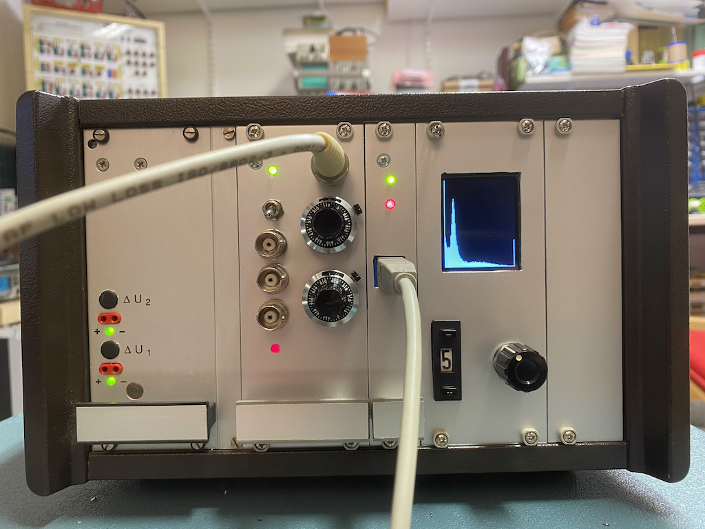

Tiny Gamma Spectrometer
=======================
This directory contains my notes and sources for building a simple gamma
spectrometer. This was mainly developed over Christmas time 2020/2021, and I 
had to use what was at hand, so there are certainly better ways to do things
which I am fully aware of. :-)

Overview
--------
Some time ago I got a photomultiplier assembly together with a plastic 
scintillator Ne102 (which is not all too well suited for gamma spectroscopy
but it is a start) from an old environmental monitoring station in Germany. 
Since great devices like these have to be used, I decided to try and build
a simple gamma spectrometer, the first attempt of which can be seen here:

This project does not (!) include a high voltage power supply as I had a 
Knott high voltage supply in my lab which simplified things considerably.

The small chassis shown above contains (from left to right) a dual power
supply yielding +/-12 V, my analog front end card, a narrow card containing
an Arduino MEGA 2650 and a little TFT display showing the spectrum in real
time during measurement.

A simple analog front end for a gamma spectrometer
==================================================

This section describes the analog front end card shown above. On its front
panel are several BNC jacks, two precision potentiometers with precision
dials, a polarity selector switch, and two LEDs. The green LED is just a 
power-on LED, while the read LED lights whenever a pulse from the 
photomultiplier assembly has been detected. The BNC input on the upper 
right is connected to the photomultiplier. The upper precision potentiometer
controls the gain of the peak hold stage while the lower sets the 
threshold for the comparator detecting pulses. The toggle switch selects
the polarity of the input signal. The three BNC connectors below it yield
the following signals: Raw signal (inverter or non-inverted, depending on
the setting of the toggle switch), the amplified output of the peak hold
stage and a TTL trigger signal.

The circuit board looks like this:

...and here is the schematic:

Functionality
-------------
What tasks are to be performed by the analog front end? First of all it 
receives the raw impulses from the photomultiplier tube which can be of 
either polarity. Since the following electronics requires positive impulses,
the input stage consists of two fast operational amplifiers (OPA4197), one
working in inverting mode and one working as non-inverting amplifier. The
polarity is selected manually by the switch labelled "POLARITY".

This signal is then fed to two sub-circuits: The first being a simple 
comparator (LM339) with adjustable threshold, the second one is a peak hold
stage. I experimented quite a lot with peak hold circuits but could not come
up with a suitable setup and thus decided to use a PKD01 integrated circuit
which is, unfortunately, long since obsolete. The PKD01 even has a built-in
comparator which would have rendered the LM339 unnecessary but at this stage
the overall circuit had already been implemented, so the LM339 stayed in 
place. :-} 

The output of the peak hold circuit is buffered by an operational amplifier
and fed to a BND connector labelled "PEAKOUT". 

The output of the comparator triggers a chain of three TTL monoflops. The 
first one (U5.1) generated a PRETRIG signal which in turn triggers U5.2 which
yields the actual TRIG signal. This signal controls a LED on the front panel,
is available on a BNC connector on the front panel and is also fed to the 
backplane where it can be used to trigger an interrupt routine in the 
microcontroller collecting the data.

The PKD01 has two control inputs: RESET (pin 1) and /DET (pin 14) which are
connected to the output of the third monoflop which is triggered by the TRIG
signal generated by the second monoflop. This signal is used to reset the 
PKD01 and prime it for the next pulse.

Setup
-----
There are basically four trim potentiometers which have to be set prior to
operation:

* TM1 is used to calibrate the output buffer amplifier so that the values
  shown on the dial of the precision potentiometer R4 correspond to the actual
  gain of the peak hold/amplifier stage.
* The three monoflops must be set to time constants suitable for the remaining
  circuitry. In my setup, the pre-trigger time is set to a few microseconds
  with TM2. The actual trigger signal duration is set to about 50 to 100 
  microseconds with TM3, while the reset signal duration is set with TM4 to
  a few microseconds again.

Limitations
-----------
This circuit has several limitations which should be addressed in the future.
First of all, the PKD01 is still looking actively for peaks, even if the 
comparator has triggered the monoflop chain. If two impulses follow each other
in rapid succession, with the second pulse being higher than the first one, 
the peak hold stage will charge its capacitor to the new peak even a trigger
signal has already been generated. 

Digital back end
================
The peak output of the analog front and the trigger signal are fed to 
another standard perf board which contains an Arduino MEGA 2650 which was
chosen due to two reasons: First, I had one at hand :-) and second, it has
enough RAM to hold the raw spectrum data as well as compressed data to 
control the tiny TFT display. This board with the attached TFT display 
looks like this:

